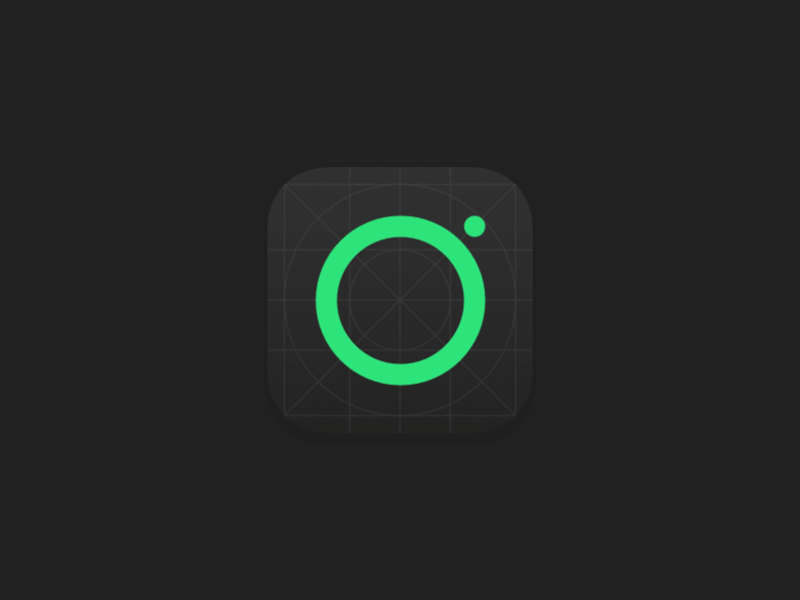

## gitHub：[https://github.com/CRAnimation/CRYoYoBallAnimation](https://github.com/CRAnimation/CRYoYoBallAnimation)

#### 本来是群里一个小伙伴的原型
原型地址：https://dribbble.com/shots/3504395-App-icon-football



#### 看着觉得还不错，难度也不大，就决定还原一下了。
#### 下面是最终实现效果，背景的网格线就没有加了


这个还是很简单的，在CAShapeLayer上使用CABasicanimation就能实现这个效果。核心代码直有一小段
```
- (void)startAnimation
{
CAMediaTimingFunction *timingFunction = [CAMediaTimingFunction functionWithControlPoints:0.79 :0.14 :0.13 :0.83];

CABasicAnimation *animation = [CABasicAnimation animation];
animation.keyPath = @"transform.rotation";
animation.duration = 2.5
;
animation.repeatCount = INFINITY;
animation.byValue = @(M_PI * 2);
animation.timingFunction = timingFunction;
[_ballContentLayer addAnimation:animation forKey:animation.keyPath];
}
```
要点也只有两个，
*  `animation.repeatCount = INFINITY;`
动画循环次数设为`INFINITY `，无穷大
* `CAMediaTimingFunction`速度控制函数，用于控制小球的运动速度。
关于这个函数，大家可以看下[动画解释](https://objccn.io/issue-12-1/)里“时间函数”的部分。另外，对于这个函数里四个参数，可以参考在线工具[CAMediaTimingFunction playground](http://netcetera.org/camtf-playground.html)来理解

